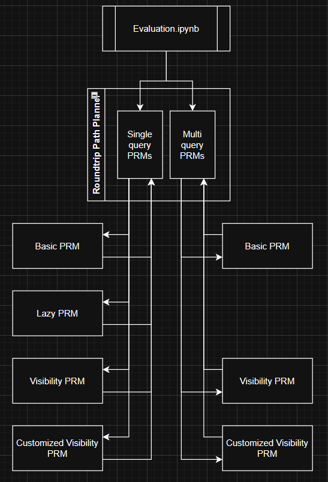

# Roundtrip Path Planning

Project Assignment: Roundtrip Path Planning

## Project overview

The task was to create a roundtrip path planner which would compute a path though obstacles with one start position and multiple goals. The solution makes use of several probability roadmap algorithms (RRMs)

1. Basic PRM

2. Lazy PRM

3. Visibility PRM

and a Customized version of the visibility PRM:

4. Visibility PRM with

    - Early stopping
    - Cross connected nodes

## Setup Instructions

This repository contains all the required PRM algorithms, testing environments and an evaluation environment. To install the project locally, follow these steps:

### 1. Clone the Repository

   ```sh

   git clone https://github.com/moritzscheckenbach/Roundtrip_Path_Planning 

   ```

### 2. make sure you have the following python libraries installed:

- copy
- descartes
- heapq
- math
- matplotlib
- networkX
- numpy
- pandas
- random
- scipy
- shapely
- sys
- time

### 3. make sure you have a version of [Jupyter Notebook](https://jupyter.org/) installed

## Usage Instruction

To jump right into using the project, open any of the Evaluation notebooks under >> roundtrip_path_planner >> Evaluation_xxxxxx.ipynb. You will find a Jupyter Notebook with the following content:

1. A notebook cell with library inclusion of project files

2. A cell with the setup, where the environment is selected, and start & goals are defined.

3. Cells with all probability roadmaps on the selected environments with the intermediate paths and completed path.

4. A visualisation of runtime, graph size and path length.

## Benchmarking

You can find a comparison of the PRMs within the Evaluation_XXXX.ipynb files, at the bottom.
Additionally, there is an overview here.
The performance metrics chosen are the following:

- Roadmap size indicates the total amount of nodes in any given graph
- Plan time is how long it took to compute the solution
- Path length is the amount of nodes required from start through all nodes
- The success factor was introduced to debuff algorithms which did not find a path in one of the three runs.

These metrics were created by averaging the performance criteria of five runs, repeating that on seven maps with three goals each for all PRMs. The tests were only done for single query PRMs because the provided algorithms are not compatible with a multi-querying solution. We implemented a multi-query option for our customised VisibilityPRM. But in the scope of the project, we didnt create modified versions of the other PRMs.


The evaluation table shows that in three of the four compared categories the overall best algorithm of the tested ones is the visibilityPRM_custom.


# Project Documentation

The algorithms in this project were chosen to cover multiple PRM variants (IPBasicPRM, IPLazyPRM, IPVisibilityPRM) plus a custom extension of visibility PRM with early-stopping and cross-connected nodes.

## Steps taken during the implementation

The main idea of this project was to take already existing programs of probability roadmap algorithm and create an interface to compute a connected path for multiple goals. In the beginning, we started by learning and understanding the source code that was given to us. From there on we decided on the format of the interface: which method can be selected and how do we define the start and goal positions and what will be returned by all subprograms. The following image is an overview on how the roundtrip path planner interacts with these programs:



The roundtrip path planner can be used in single-query and multi-query modes. In single-querying, it calculates paths between the start and multiple goals but discards the created maps in between. The final map is created by appending the intermediate roadmaps. Using multi-query mode results in one map with several connections to start and goals, as shown in the following image.


Furthermore, we were supposed to implement an optimized design based on the given visibility PRM. The optimizations include two ideas:

1. Cross connecting nodes, where connections between guards that see each other receive an edge between them.

2. Early Stopping, where the creation of the roadmap is interrupted, when start and all goals have a connecting path.


## Challenges

### Ensuring Compatibility Across Algorithms

Some algorithms in this project are single-query while others are multi-query. Since their input requirements differ, it was necessary to carefully design interfaces that accommodate diverse planning approaches without creating duplicate code.

### Visualizing the Complete Solution

A key challenge involved visualizing a unified path constructed from multiple sub-paths. Although the visualization for individual segments was already implemented for each goal, consolidating those segments into a single, comprehensive path posed difficulties. Single-query algorithms overwrite internal graphs on each call. To address this, a dedicated “whole solution” variable was introduced to store intermediate paths.

### Optimizing the Visibility PRM

Integrating optimization steps in the visibility PRM proved complex due to the nature of the collision checker. Ensuring that edges were only added to the roadmap after appropriate collision checks required careful code structure. The requirement that all start, intermediate goals and final goal positions only are allowed to visit exactly once reduced the possibilities for graph optimizations.

### Working with Git

This project served as the team’s introduction to Git, leading to fewer branches and many direct commits to the main branch. Although this approach worked, future projects will incorporate more robust branching and commit strategies.

## Project Submission

This project was the exam for the lecture "Roboterprogrammierung" of the robotics and artificial intelligence master at Hochschule Karlsruhe, University of Applied Sciences. The Solution was submitted by Wesley Glauben, Janik Marten and Moritz Scheckenbach.
